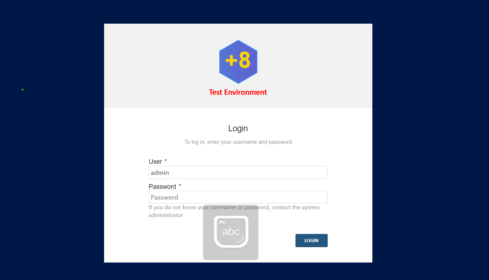
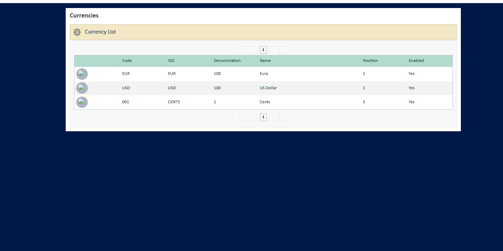
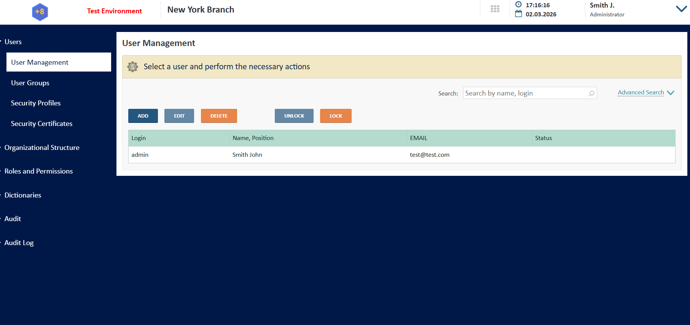
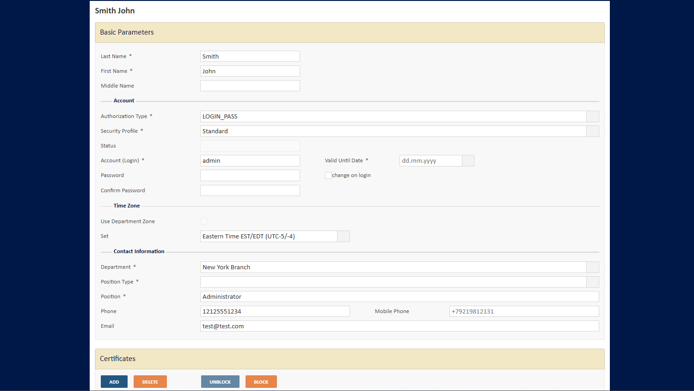
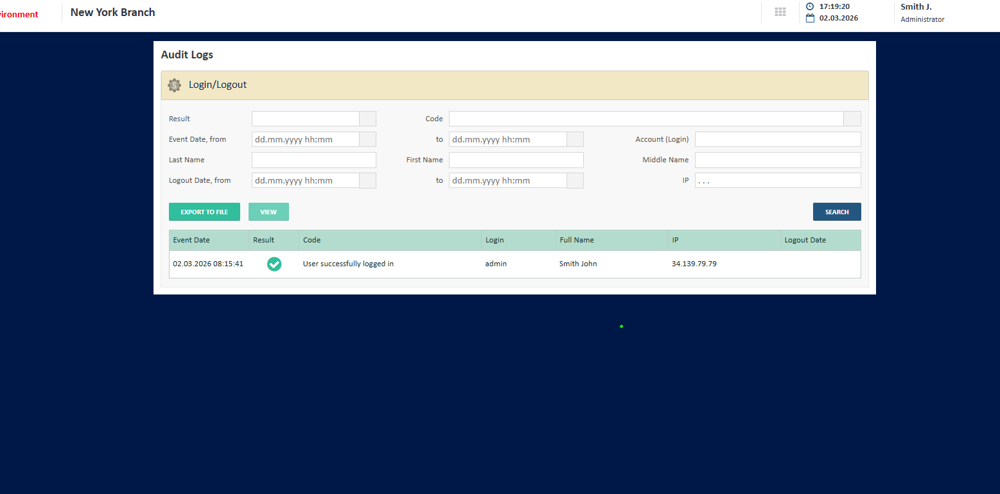

# Features (detailed)

This document describes the main features of the Front Office application with references to the UI and screenshots where available. For integration and architecture, see [INTEGRATION_AND_ARCHITECTURE.md](INTEGRATION_AND_ARCHITECTURE.md). For the high-level "what works / what is stubbed" overview, see [README.md](README.md).

> **Reading this document.** A status badge is added to each section:
>
> - ✅ **Works out of the box** — fully functional on the Front Office DB after a fresh deploy.
> - ⚠️ **UI ready, needs a core adapter** — screens, validation and print forms are present; the "Process" step is stubbed and requires you to wire your own core banking integration (see [README → Wiring your own core](README.md#wiring-your-own-core)).
> - 🔌 **Stub / placeholder data** — the dictionary or service ships with sample data; replace with a real API for production.

---

## 1. Authentication and access ✅

- **Web-based access** — the application is client-server; users work in a standard web browser. No thick client installation.
- **Login** — username/password authentication. Default demo user: `admin` / `123456789a` (change in production).
- **E-signature** — the architecture allows integration of e-signature for authentication or operation confirmation (Enterprise Edition).
- **Active Directory / LDAP / SAML / OIDC** — can be integrated via Spring Security (Enterprise Edition).

*Login screen.*

---

## 2. Client management (CRM) — client file (card), documents, photos ✅

- **Client card (client file)** — unified profile for each client: personal data, contacts, addresses. The application maintains a full client file per client.
- **Documents** — store and view scans of passport, contracts, and supplementary agreements; attach documents to the client card or to an operation. You can add supplementary agreements and other documents to the client file.
- **Document expiry tracking** — track and monitor the validity period of documents (e.g. passport, power of attorney, contract, supplementary agreement). The system supports alerts or reporting when documents expire.
- **Photo capture from webcam** — single still photo taken from the browser webcam (`Webcam.snap()`) and stored in the client dossier. Manual photo upload from a file is also supported.

> **Not included in Community Edition:** video recording from the webcam, face matching, liveness detection, biometric or AI-based identification. These are part of the Enterprise Edition.

The client data model and document storage are in the CRM schema; see [INTEGRATION_AND_ARCHITECTURE.md](INTEGRATION_AND_ARCHITECTURE.md) (Database structure).

### Apache Fineract integration (optional) ✅

When `integration.fineract.enabled=true`, the CRM is two-way synced with Apache Fineract for **clients only**:

- Search Fineract clients from the Client Search screen.
- Import a Fineract client into CRM.
- Link an existing CRM client to a Fineract client.
- On CRM save, the client is created/updated in Fineract.

See [FINERACT_INTEGRATION.md](FINERACT_INTEGRATION.md). Fineract does **not** cover transfers, currency exchange, or WOA payments out of the box; those still need an adapter.

---

## 3. Currency exchange ⚠️

- **Operations (UI)** — buy/sell currency screens, order handling screen, validation, fee calculation, print forms. ✅
- **Rates (UI + local)** — manual edit of currencies and rates; rate orders saved locally with PDF and email to cashiers. ✅
- **External / market rate "Update"** — currently a stub (`ExternalRateService`, `MarketRateService`). 🔌
- **Process operation (Step 4)** — stubbed. Returns *"Core banking is not connected"*. Replace `CurrencyExchangeBackService` with your adapter to actually post the operation and pull cash balances from the core. ⚠️

| Currencies dictionary | Exchange rates |
|----------------------|----------------|
|  |  |

---

## 4. Transfers and payments ⚠️

- **Send transfers (UI)** — full flow with payment-system selection (Money Transfer, Western Union, MoneyGram), fee calculation, recipient data, print forms. ✅
- **Receive (payout) transfers (UI)** — full flow and views per payment system. ✅
- **Payment-system data** — `PaymentTransferService` ships with test data (payment points, fees, transfer lookup). 🔌
- **Process / Confirm to core** — stubbed. Returns *"Core banking is not connected"*. Replace `TransferBackService` (and optionally `PaymentTransferService`) to call your core or a real WU/MoneyGram API. ⚠️
- **Payment systems** — extensible via `PaymentSystemName` and flow XML; see [INTEGRATION_AND_ARCHITECTURE.md](INTEGRATION_AND_ARCHITECTURE.md).

---

## 5. WOA payments (one-off / counterparty payments) ⚠️

- **Full UI for counterparty payments** — TIN search, category selection, payment type (legal entity / public sector / taxes), purpose, sum, commission, VAT. ✅
- **Demo counterparties / categories** — seeded via Liquibase demo data (`db/2.0.0/demo-data.xml`). 🔌
- **Process to core** — stubbed. Replace `WoaPaymentBackService` with your adapter. ⚠️

---

## 6. Administration ✅

- **Users** — create, edit, disable; assign roles and security profiles.
- **Roles and rights** — role-based access control (RBAC); fine-grained rights.
- **Groups** — user groups for grouping staff (e.g. by department or function).
- **Departments** — organisational structure (departments/branches).
- **Audit** — logging of user actions (who did what and when) and IO connections.

| User management | User edit |
|-----------------|-----------|
|  |  |

| Audit logs |
|------------|
|  |

---

## 7. Dictionaries and reference data

- **Manual edit ✅** — countries, currencies, banks, accounts, payment systems, address elements maintained in the DICT schema with full CRUD.
- **"Update" from external sources 🔌** — Banks and external/market rates currently use stubs (`BankService`, `ExternalRateService`, `MarketRateService`). Replace with a real registry / rate provider for production. Countries have no automatic update.
- **Custom dictionaries** — extended dictionaries with manual or automatic update; see [INTEGRATION_AND_ARCHITECTURE.md](INTEGRATION_AND_ARCHITECTURE.md).

---

## 8. Reports ⚠️

- **Application-rendered reports ✅** — iText PDF receipts and print forms for transfers, rate orders, WOA, and similar; rendered by `ReportService` and printable from the browser.
- **Operation reports from the core ⚠️** — data comes from core stored procedures mapped to entities like `OutputOperationData` (`web/repository/back/ce/...`). These return empty when no core is wired. Provide your own SP / API and adjust the mapping.
- **MS Word-based reports ⚠️** — `MsReportService` is disabled by default (`@Component` commented out): requires Windows and Microsoft Word (COM4J). The Enterprise Edition provides a cross-platform PDF generation module that does not require Word.

---

## 9. Hardware integration (printers, scanners, webcams) ✅ / ⚠️

- **Webcam ✅** — single still photo capture for the client card (`webcam.min.js`, `Webcam.snap()`). No video recording.
- **Printers ✅** — printing receipts, slips and print forms from the browser via standard PDF dialogs.
- **Scanners ⚠️** — the data model includes a `SCANNER` addition method for document copies, but no built-in TWAIN / scanner driver. Plug in your own browser extension, local helper service, or device API for direct-from-scanner capture.

> **AI-assisted / biometric / video KYC is not part of the Community Edition.** Use the Enterprise Edition or integrate your own provider.

---

## 10. Deposits, safes, and other products

The product is designed so that **deposits**, **current accounts**, and **safe deposit boxes** can be added as modules or extensions. The core (this repo) provides user management, client cards, and the operations framework; product-specific logic is integrated via services and UI flows (see [INTEGRATION_AND_ARCHITECTURE.md](INTEGRATION_AND_ARCHITECTURE.md)).

Today the client card has placeholders for deposits and credits — they read from a back service that returns empty without a wired core.

---

## Summary

| Area | What the application offers | Status |
|------|----------------------------|--------|
| Access | Web browser; login/password | ✅ |
| Clients | Card, contacts, addresses, documents, photo (webcam still), expiry tracking | ✅ |
| Fineract clients sync | Search, import, link, sync on save | ✅ when enabled |
| Currency exchange | Full UI; posting to core | ⚠️ adapter needed |
| Transfers | Full UI; posting / payment-system data | ⚠️ adapter needed (data also stubbed) |
| WOA payments | Full UI; posting to core | ⚠️ adapter needed |
| Administration | Users, roles, groups, departments, audit | ✅ |
| Dictionaries | Manual edit | ✅ |
| Dictionaries auto-update (banks, rates) | Stub | 🔌 |
| Reports | App-rendered PDFs | ✅ |
| Reports from core stored procedures | Need core | ⚠️ |
| Word-based reports | Windows + Word only, off by default | ⚠️ |
| Webcam | Single still photo | ✅ |
| Video / face matching / biometric KYC | — | Not in Community |

For technical integration points and database layout, see **[INTEGRATION_AND_ARCHITECTURE.md](INTEGRATION_AND_ARCHITECTURE.md)**.
