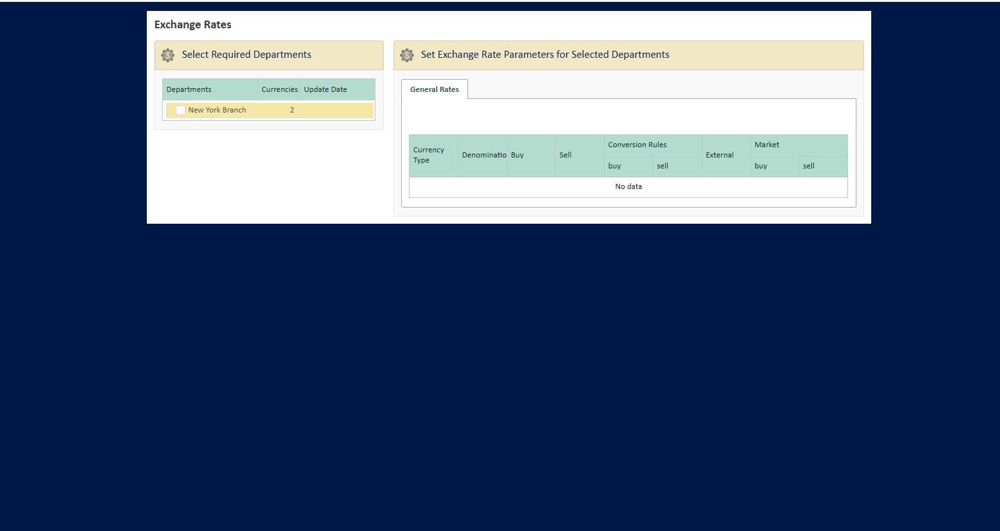

## FRONT OFFICE APPLICATION — PROJECT DESCRIPTION

### Company

Front Office Application is developed and supported by **Plus8Soft**, a software development outsourcing company focused on comprehensive full-stack development services and flexible outstaffing solutions to help bring innovative ideas to life.
With **20+ years of global experience**, Plus8Soft has mastered the art of assembling exceptional engineering talent — both to deliver world-class software end-to-end and to become a strong part of clients' existing teams.

More about the company: [plus8soft.com](https://plus8soft.com)
Commercial support, subscriptions, and questions: `support@plus8soft.com`

### Overview

Front Office Application is an open-source (Apache 2.0) **client-server teller-facing UI** for front-office staff: tellers, cashiers, and managers. Access is through a web browser — no thick client to install on workstations.

The application targets banks, insurance companies, MFOs, and any organization with in-person client service. It provides screens for client management, currency exchange, transfers, and counterparty payments; user/role administration; reference dictionaries; and integration points for peripherals (printer, webcam) and external systems.

It is **not** a banking core: it does not keep balances, settle transactions, or post double-entry accounting on its own. To actually post a teller operation, the application must be connected to a core banking system through one of the supported integration paths (see [README → Wiring your own core](README.md#wiring-your-own-core)).

### What works out of the box (Community Edition)

- **Client management (CRM)** — client file with profile, contacts, addresses; documents (passport, contracts, supplementary agreements); document expiry tracking; **single-still photo capture** from a webcam into the client dossier; manual photo upload.
- **Apache Fineract integration (optional)** — two-way sync of **clients** with Apache Fineract (search, import, link, sync on save). See [FINERACT_INTEGRATION.md](FINERACT_INTEGRATION.md).
- **Currency exchange — full UI** with operations, orders, rates, validation, fee calculation, and print forms. Rate orders are saved locally with PDF and email to cashiers.
- **Transfers — full UI** for send / receive flows with payment-system selection, fee calculation, print forms.
- **WOA payments — full UI** for one-off counterparty payments (TIN, category, payment type, purpose, sum, commission, VAT).
- **Administration** — users, roles, groups, departments, audit logs.
- **Dictionaries** — manual edit for countries, currencies, banks, payment systems, address elements; address autocomplete in client forms.
- **App-rendered PDF reports** via `ReportService` (iText): receipts, print forms, rate orders.

### What needs your own adapter or stays stubbed

| Capability | Out of the box | What to do for production |
|------------|---------------|---------------------------|
| Currency exchange — **Process to core**, cash balance, business-day check, install rates to core | Stub returns *"Core banking is not connected"* | Implement `CurrencyExchangeBackService` (REST/SOAP/JDBC to your core) |
| Transfers — **Process to core** | Same stub | Implement `TransferBackService` |
| Transfers — payment-system data (Western Union, MoneyGram, etc.) | Test data (`PaymentTransferService`) | Replace with real gateway APIs |
| WOA payments — **Process to core** | Same stub | Implement `WoaPaymentBackService` |
| Client products on card (deposits, credits) | Empty without core | Implement `PersonBackService.findDeposits/findCredits` |
| Sanctions / passport-registry checks | Skipped without core | Implement in `PersonBackService` |
| Dictionary "Update" — banks, external/market FX rates | Stubs in `web/service/stubs/...` | Plug in your registry / rate provider |
| Operation reports from core stored procedures | Need core | Provide SP/API; adjust `OutputOperationData` mapping |
| Word-based reports (`MsReportService`) | Off by default; Windows + Word only | Use app-rendered PDFs or the Enterprise PDF module |

### What is NOT included in Community Edition

- **Biometric / video / AI-assisted KYC** — face matching, liveness detection, automated video identification. The Community Edition supports **only a still photo from a webcam** stored in the client card.
- **SSO** (SAML / OIDC), AD / LDAP integration.
- **Sanctions screening** (OFAC / EU / UN / HMT).
- **Pre-built core-banking connectors** (Temenos, Finastra, Finacle, FIS, Fiserv, Mambu, Oracle FLEXCUBE).
- **SWIFT MT / MX, ISO 20022, card-management-system integrations**.
- **Multi-branch / multi-tenant**, HA / DR, LTS branches, 24/7 SLA support.

These are part of the Enterprise Edition — contact `sales@plus8soft.com`.

### Tech stack

- **Backend**: Java 8, Spring MVC, Spring Security, Spring Data JPA, Spring Web Flow
- **Frontend**: JSF (Jakarta Faces), PrimeFaces (server-side rendering)
- **Database**: Microsoft SQL Server, Liquibase for schema migrations
- **Build**: Gradle

### Quick start

1. **Build**
   ```bash
   ./gradlew :web:war
   ```
2. **Configure**
   Copy `front-office.properties.example` to `front-office.properties` and set `datasource.url`, `back.datasource.url`, `lob.datasource.url` (and optionally SMTP). Keep `integration.back.enabled=false` for the first run. Do not commit `front-office.properties`.
3. **Deploy**
   Deploy the WAR from `web/build/libs/web.war` to a servlet container (e.g. Apache Tomcat). Configure the container to use `front-office.properties`.
4. **Sign in**
   After first run: **login** `admin`, **password** `123456789a`. Change in production.

### Screenshots

- **Login page**


- **User management**


- **User edit**


- **Currencies**


- **Exchange rates**



- **Audit logs**


---

## Product description — business view

### Main capabilities (Community Edition)

- **Client management (client file, documents, photo)**
  - Client card — single profile: personal data, contacts, addresses (with autocomplete from region, city, street dictionaries).
  - Documents — store and view scans of passports, contracts, supplementary agreements; attach to the client or to an operation.
  - Document validity — track document expiry: passport, power of attorney, contract, supplementary agreement.
  - Client photo — single still photo capture from the webcam or manual upload from a file; stored in the client dossier.
- **Operations — UI ready, posting needs a core adapter**
  - Currency exchange — buy/sell screens, rate management, teller reports, reference forms; posting stubbed.
  - Transfers — send and receive screens, payment-system selection, fee calculation; posting stubbed.
  - WOA payments — UI for one-off counterparty payments; posting stubbed.
- **Architecture for product extensions** — deposits, safe deposit boxes, accounts can be added as modules; the client and operations framework is in place, product-specific business logic is up to the integrator.
- **Hardware integration**
  - Printers — print contracts, receipts, slips from the web interface.
  - Webcam — capture a still photo for the client card. (Video, face matching, biometric KYC are not part of the Community Edition.)
  - Scanners — addition method present in the model; provide your own scanner integration (no built-in TWAIN driver).

### Authentication and authorisation (Community Edition)

- **Login/password** — standard front-office user authentication.
- **AD / LDAP / SAML / OIDC SSO, e-signature** — Enterprise Edition.

_Example screen: login_


### Administration and dictionaries ✅

- **Administration**
  - Users, roles, groups, departments — RBAC.
  - Audit — log of staff actions (who did what and when) and IO events.

_Example screens: user list, user edit, audit log_


- **Dictionaries**
  - Countries, currencies, banks, payment systems, address elements; manual edit. Bank and rate "Update" actions ship as stubs and need a real provider for production.

_Example screens: currencies and rates dictionaries_


### Reports and backend integration

- **App-rendered reports (PDF)** — fully functional, generated by `ReportService` (iText). Used for receipts, print forms, rate orders.
- **Operation reports from a core** — data is read from core stored procedures or APIs through `web/repository/back/...`. The Community Edition ships with mappings (e.g. `OutputOperationData`) and stubs; provide your own SP/API and align the mapping to make these work.
- **Extensibility** — connect core banking, payment gateways, rate providers, AML/KYC via the integration points described in [INTEGRATION_AND_ARCHITECTURE.md](INTEGRATION_AND_ARCHITECTURE.md).

---

## Integration and architecture (short)

- Client-server: server runs in the organisation's infrastructure; access only via browser.
- Current DB structure: schemas CORE, DICT, CE, CRM, LOG, PS, PAY (see Liquibase changelogs in `web/src/main/resources/db/2.0.0/`).
- Integration points exist for: banks directory, exchange-rate providers, payment systems, operation reports, AML/KYC, hardware, and core-banking posting (via `web/service/back/*BackService`).
- Replacing the back layer is the main extension task for any deployment that needs real posting — see [README → Wiring your own core](README.md#wiring-your-own-core) and [INTEGRATION_AND_ARCHITECTURE.md](INTEGRATION_AND_ARCHITECTURE.md).
